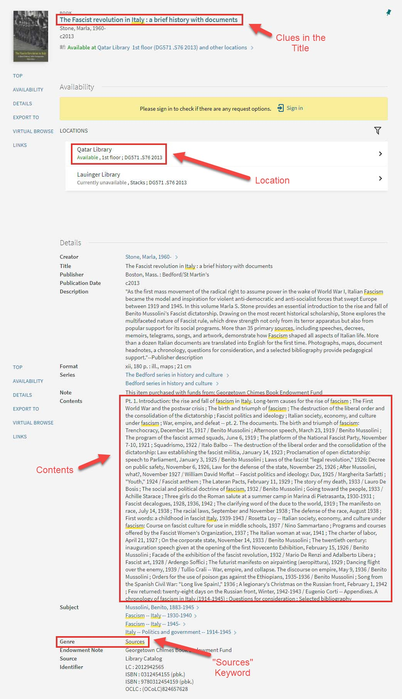

# Project - August 2021 - Primary Sources

## Introduction

At my organization, librarians perform an important task of teaching students different aspects of information literacy. Understanding how to identify, find, and access primary and secondary sources is one particularly important skill students need to master. As part of the instructional process, librarians teach students important concepts and hands-on skills related to primary and secondary sources. It's also useful to be able to assess student understanding of the material.

#### The Challenge

A key challenge of conducting instruction on topics of information literacy is to create engaging and impactful content that is accessible to students. Content that is text-heavy without a mix of other types of content (i.e. images, tables, videos, lists, etc.) is less engaging for students. Since students have extensive experience using a variety of media and devices, a key challenge is finding ways to deliver content to them that meet these standards.

#### The Solution

Instead of delivering the content in un-dynamic ways, the solution involved creating a website with a fresh look-and-feel to it. The website would essentially deliver the same content that is used with older and more static methods of delivery, but provide a fully-responsive experience with a fresh mix of the existing content and media. The solution also includes an interactive element - a quiz that students could take on the website that puts their knowledge to the test and provides immediate feedback.

<!-- Main Website Image Here -->

#### Technologies Used

The website did not require students to login and did not make use of a complex back-end, and therefore wasn't overly complex in terms of technologies needed. However, the project did present some novel challenges. First, the website design made use of Bootstrap 5, which was released in May 2021. Although this version of Bootstrap was a continuation of most of the core features in previous versions of Bootstrap, it [added many optimizations](https://blog.getbootstrap.com/2021/05/05/bootstrap-5/) including the removal of JQuery and enhancement of components like the Navbar.

In addition to Bootstrap 5, the website did make use of a dynamic approach to the quiz feature which involved loading the quiz content from an external JSON file and dynamically building the HTML and the event handlers for the quiz and its interactive features. Taking this approach adds the flexibility of adding, removing, or modifying the quiz content by updating the external JSON file alone.

## UX Design

A key goal of this project is to combine different content types like images, text, tables, and lists on the different pages to make the content more interesting for students. However, the overall design needed to remain relatively minimal to keep students focus on the core content without adding additional distractions. To achieve this, the website layout and organization took advantage of Bootstrap's grid system and components to combine text and images onto the page in a way that was easy to read and understand.

#### Home Page

The Home Page design included introductory text along with a hero image and a call to action buttons. Further down the page, there are several header, text, image combinations that are intended to briefly introduce students to the main themes of the website that are explored in more detail on the website sub-pages. The intent of the home page is to draw students into the website visually and show them how to get started.

<!-- Home Page Image -->

#### Sub-Pages

The sub-pages of the website explore different ways to combine content, text and images or text as tabular content in the example here. Lines of text are also kept short to improve readability. The sub-pages were the core "instructional" spaces of the website, therefore the design focused on highlighting key concepts and providing multiple examples using images and different text combinations. Bootstrap offers several different components - tables, images with captions, etc. to present content attractively.

<!-- Sub-Page Image -->

#### Card Component

One of the most versatile Bootstrap components is the [card component](https://getbootstrap.com/docs/5.1/components/card/). There are many different ways to combine content on a card component. For the design of this website, the card component is used for the examples of primary sources and included images along with textual details within each card.

<!-- Example of Content Card -->

Also making use of the card component, the website's quiz page presents a card that contains an image and question with a vertical button group that contained multiple choices for students to select.

<!-- Example of Quiz Card -->

## Information Architecture

As mentioned earlier, the website is not particularly complex and only contains a handful of pages. Essentially, the website has a top-level home page and several sub-pages at a depth of only one level. The sub-pages include pages entitled:

- Primary and Secondary Sources
- Types of Primary Sources
- Finding Primary Sources
- Quiz
- Helpful Resources

## Development

The HTML and CSS were straight forward due to the use of Bootstrap. The many built-in content and layout features of Bootstrap account for almost every possible combination required for the website. Bootstrap includes useful layout features such as flexbox, which can be applied easily with a handful of class selectors.accordion-body

```html
<div class="col-md-12 d-flex justify-content-center">
  
</div>
```

For example, the code above shows an image that is horiztonally centered by applying the `d-flex` and `justify-content-center` selectors to a parent element. The child element, in this case an image, is centered within the parent element without the need to do anything additional.

Bootstrap comes with many other helpful features for things such as the `ratio` class, which can be used in combination with other related classes to create a [16:9 aspect ratio](https://getbootstrap.com/docs/5.1/helpers/ratio/) for an image or embedded video.

```html
<div class="ratio ratio-16x9">
  <iframe
    src="https://www.youtube.com/embed/58BIJAPDxL4"
    frameborder="0"
    allow="accelerometer; autoplay; clipboard-write; encrypted-media; gyroscope; picture-in-picture"
    allowfullscreen
  ></iframe>
</div>
```

In the code above, the classes `ratio` and `ratio-16x9` are used to create a 16:9 aspect ratio for an embedded YouTube video.

#### Quiz Page

The quiz page provided an opportunity to be more ambitious. The quiz page loaded data from an external JSON file and then looped through it to dynamically create the quiz DOM elements, content, and event handlers. The JSON file organized the data using key-value pairs.

```javascript
{
  "id": 1,
  "question": "Primary or Secondary Source?",
  "image": "quiz-1.png",
  "title": "The Bolshevik revolution and Russian Civil War",
  "link": "https://wrlc-gu.primo.exlibrisgroup.com/permalink/01WRLC_GUNIV/13v2bp2/alma991011744269704111",
  "answers": ["Primary Source", "Secondary Source"],
  "answerDetail": "This is a secondary source because it is a book written by a historian who has consulted relevant primary and secondary sources to produce a new analysis of the historical events of the Bolshevik revolution and Russian Civil War.",
  "correctAnswer": "Secondary Source"
}
```

The data contained in the JSON file was an array of data objects which made use of a variety of data types. To load the JSON file into the javascript file, the [fetch API](https://developer.mozilla.org/en-US/docs/Web/API/Fetch_API) was used asynchronously.

```javascript
const getQuizData = async () => {
  const response = await fetch('./js/quiz-data.json');
  const data = await response.json();
  buildQuiz(data, addAnswers);
};
```

Once the data was loaded and parsed, the resulting array of objects was passed onto the `buildQuiz` function. The main purpose of the `buildQuiz` function is to create the DOM elements and event handlers for the quiz cards. The function loops through the data and uses object destructuring to extract the discrete data pieces that is needed to build the quiz question cards.

```javascript
const buildQuiz = (data, addAnswersCallback) => {
  data.forEach(
    ({
      id,
      question,
      image,
      title,
      link,
      answers,
      answerDetail,
      correctAnswer,
    }) => {
      const newQuestion = buildQuestion(
        id,
        question,
        title,
        link,
        image,
        answers,
        answerDetail
      );
      questionsContainer.appendChild(newQuestion);
      addAnswersCallback(id, correctAnswer, data.length);
    }
  );
};
```

The `buildQuestion` function passes data to several additional functions responsible for building parts of the final quiz question card. For example, the image in the question card is constructed by creating a `div` element and an `img` element. Each element has its attributes set dynamically, passing information as parameters. The final image is then returned from the function and will be used in combination with other similar DOM elements to build the final quiz question card.

```javascript
const createImage = (image) => {
  const imageContainer = document.createElement('div');
  const imageElement = document.createElement('img');

  imageContainer.setAttribute('class', 'col-md-4');
  imageElement.setAttribute('src', `images/${image}`);
  imageElement.setAttribute('alt', `${image.split('.')[0]}`);
  imageElement.setAttribute('class', 'img-fluid');

  imageContainer.appendChild(imageElement);

  return imageContainer;
};
```

#### Handling Quiz Events

As a student works through the quiz, each question is presented one at a time. Once a user has answered a question and viewed the feedback, the "Next Question" button becomes enabled and they can continue to the next question. To handle the progression of the quiz from question to question, the `nextQuestionButton` has an event listener attached to its `click` event. When a student clicks the button, the event is triggered and a loop is run over the dynamically created quiz question cards to determine which question should be made visible by comparing a `currentQuestion` variable to the `id` of each question card. Next, a function called `toggleNextButtonState` is called to determine whether the "Next Question" button should be enabled or disabled. The current card variable value is incremented and the `checkFinished` function is called to determine whether the quiz is finished or not.

```javascript
nextQuestionButton.addEventListener('click', () => {
  let cards = document.querySelectorAll('.card');

  cards.forEach((card) => {
    card.attributes.id.value === `q-${currentCard}`
      ? card.classList.remove('d-none')
      : card.classList.add('d-none');
  });

  toggleNextButtonState();
  currentCard++;
  checkFinished(cards.length);
});
```

## Conclusion

Although this project was fairly simple on the surface, it included several challenging features. First, the project provided an opportunity to learn and apply the latest version of Bootstrap. Secondly, the project was an opportunity to challenge myself in loading data and dynamically creating DOM elements and event handlers. Creating complex DOM elements and nesting them correctly within other DOM elements was challenging since the order and parent-child relationships were important. Building HTML dynamically is possible with pure JavaScript, but it is much easier in Frameworks like React where JSX is used to create the DOM elements in an intuitive way. The final website was a success and worked as desired, delivering a good user experience on a variety of devices.
